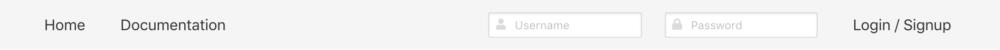
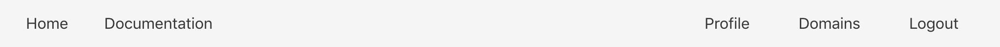
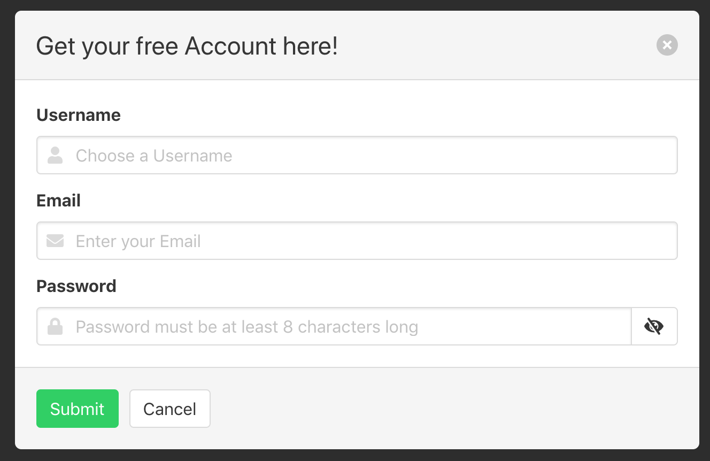

# React / GraphQL Authentication

This project is about me learning a Javascript framework called [React](https://reactjs.org) and [GraphQL](https://graphql.org). Like always, it's easier to learn new stuff when applying it to a project.  
I decided to create a simple authentication system.

The theme is made with [Bulma.io](https://bulma.io) because I wanted to try out a popular alternitive to [Bootstrap](https://getbootstrap.com). The docmentation for Bulma is also really good.

For saving the login credentials I used [jsonwebtoken](https://github.com/auth0/node-jsonwebtoken).

## Database

To store all the user data I use a simple json file based database called [lowdb](https://github.com/typicode/lowdb). I didn't want to install a local DB only for a little project.  
Even though I implemented all database actions in a seperate class. It would be kinda easy to refactor the database to MySQL only by changing this class. All other code still behave the same.

Passwords are also stored in a hashed format to increase security. This is done via [bcrypt](https://www.npmjs.com/package/bcrypt).

### Class snippet

```js
import low from 'lowdb';
import FileSync from 'lowdb/adapters/FileSync';

const adapter = new FileSync('./databaseUser.json');
const userLow = low(adapter);

userLow.defaults({ users: [] }).write();

class userDB {
    async getUserByEmail(email) {
        return userLow
            .get('users')
            .find({ email })
            .value();
    }

    async updateToken(username, token) {
        return userLow
            .get('users')
            .find({ username })
            .set('iat', jwt.decode(token).iat)
            .write();
    }
}
```

### File preview

```json
{
    "users": [
        {
            "username": "test",
            "password":
                "$2b$10$L72HnDgRvpS9N87iuTdZcewJMNmNFeep21HCgnFU0hv6b/FoXI36.",
            "email": "test@test.de",
            "iat": 1528578690
        }
    ]
}
```

## API

While searching the web for an alternative to Axios with Express, I learned about GraphQL. This API should fit nice into React.  
At the beginning it was kinda hard to learn, because it works really different to other API's out there.

After setting my application up for handling GraphQL, the steps were gettin easier and faster along the way. Implementing more and more requests were faster after the core work was done.

### GraphQL snippet

```js
const typeDef = gql`
    type User {
        username: String
        email: String
        jwt: String
    }
    type Mutation {
        usernameExists(username: String!): Boolean
        emailExists(email: String!): Boolean
        passwordCorrect(username: String!, password: String!): Boolean
        login(username: String!, password: String!): User
        signup(username: String!, email: String!, password: String!): Boolean
        verifyToken(token: String!): User
    }
`;

const resolver = {
    Mutation: {
        usernameExists: async (obj, { username }) => {
            return await checkUsername(username);
        },
        emailExists: async (obj, { email }) => {
            return await userDB.getUserByEmail(email);
        },
        passwordCorrect: async (obj, { username, password }) => {
            return await checkPassword(username, password);
        },
        login: async (root, { username, password }, context) => {
            const user = await checkUsername(username);

            if (user) {
                const checkedPassword = await checkPassword(username, password);
                if (checkedPassword) {
                    const token = jwt.sign(
                        {
                            username
                        },
                        config.jwtSecret
                    );

                    const u = await userDB.updateToken(username, token);

                    return { username: u.username, email: u.email, jwt: token };
                } else {
                    throw new Error('Password is incorrect!');
                }
            } else {
                throw new Error('Username does not exist!');
            }
        },
        signup: async (obj, { username, email, password }) => {
            return await userDB.addUser(username, email, password);
        },
        verifyToken: async (obj, { token }) => {
            try {
                const decoded = jwt.decode(token);
                const user = await userDB.getUser(decoded.username);
                if (user) {
                    if (user.iat === decoded.iat) {
                        return { username: user.username, email: user.email };
                    } else {
                        return null;
                    }
                } else {
                    return null;
                }
            } catch (err) {
                return null;
            }
        }
    }
};
```

## State Management

For state management of react applications many people use [ReduxJs](https://redux.js.org). I thought this is really complex because you have to pass everything to the props of your components. Sometimes this gets really annoying when adding some functions to your state.  
You always have to make sure to pass them correctly to every component which needs to access this function.

After searching the web I learned about [MobX](https://mobx.js.org). I used Webpack to write ES6 code anyways, so I added another plugin to allow decorators in my javascript files. This function is really handy because MobX comes with alot of nice and easy to handly decorators.

Every component which needs to access one specific state, just needs to get it inserted via decorators.  
In my opinion the code looks way cleaner and easier to read.

### User State snippet

```js
class userStore {
    @observable username = '';
    @observable email = '';

    @observable isAuthenticated = false;

    @action
    login(username, email, token) {
        localStorage.jwtToken = token;

        this.username = username;
        this.email = email;
        this.isAuthenticated = true;
    }

    @action
    logout() {
        if (localStorage.jwtToken) {
            delete localStorage.jwtToken;
        }

        this.isAuthenticated = false;
        this.username = '';
        this.email = '';

        client.resetStore();

        history.push('/');
    }
}
```

### Example observer / injection

```js
@observer
@inject('userStore')
class LoginHeader extends React.Component {
    constructor(props) {
        super(props);
        this.state = {
            username: '',
            password: '',
            isLoading: false,
            errorUsername: false,
            errorPassword: false,
            signup: false
        };
    }
}
```

## Screenshots

### Navbar



### Logged in



### Signup modal


